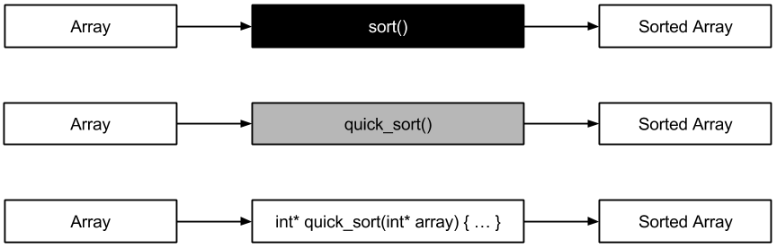

## Software testing in general

Abych se mohl zaměřit na testování RESTful API, považuji za vhodné nejprve zopakovat základy testování software. Jedná se o součást procesu vývoje software, která je velice důležitá, ale která bývá z různých důvodů opomíjena či je jí přikládána menší důležitost. Pokud je vyvíjený software testován, je vhodné mít přehled o možnostech testování a právě tyto možnosti v této kapitole stručně popíšu. Následující kapitoly budou předpokládat znalost zde uvedených pojmů a souvislostí.

Budu se věnovat celkem třem různým klasifikacím testů. Je vhodné si uvědomit, že konkrétní jeden test či skupina testů může být zařazena do více než jedné skupiny a že lze různé vlastnosti testů téměř libovolně kombinovat.

### Testing methods

Software nebo samotný kousek kódu je možné testovat různými úhly pohledu. Pokud píšeme jednoduchou funkci, může se nám zdát dostačující otestování metodou "kouknu a vidím". Jedná se o _statický_ způsob testování software, který je ale snadno náchylný k chybám. Sám jsem si v praxi několikrát ověřil, jak snadné je udělat chybou i v jediném řádku kódu, který byl navíc zkontrolován v rámci _code review_ dalším vývojářem. Osobně považuji tento způsob testování za nedostatečný. Metodu _code review_ považuji za kontrolu splnění _coding standards_ než ověření správně funkčnosti.

K ověření správné funkčnosti je potřeba _dynamický_ přístup, tedy spustit kód a zkontrolovat, zda se chová dle očekávání. Tento přístup považuji za velmi praktický, protože testuje to, **co kód opravdu dělá** a netestuje **co si vývojář myslí, že kód dělá**. V případě testování software v různých běhových prostředích tak vývojář nemusí přemýlet na různými možnostmi, ale jednoduše spustí testy v každém běhovém prostředí, které chce otestovat. Stále je ale potřeba se rozhodnout, jak budeme testovaný kód pouštět a jakou metodu testování zvolíme. Podívejme se na tři, dle mého názoru nejčastější, metody.

#### Black-Box testing

Tuto metodu osobně považuji za nejjednodušší, protože testy není potřeba měnit při změně vnitřní implementace kódu. Testovaný kód považujeme za _black box_, který na základě vstupních parametrů vrátí nějaký výstup. Je důležité, aby testovaný kód vrátil pro každé volání se stejnými parametry vždy stejný výsledek. Mohou samozřejmě existovat výjimky, jako například testování generátoru náhodných čísel, ale zde bychom testovali kód na základě více výstupů a ne na základě pouze jednoho.

Za velkou výhodu této metody považuji možnost zadat testování někomu, kdo nezná imlementaci. Dokonce je možné připravit testy ještě před samotnou implementací. Z toho usuzuji, že se jedná o vhodnou metodu pro tzv. Test Driven Development. Nevýhodou ale zůstává fakt, že bez znalosti konkrétní implementace může být problém se specifikací vstupních parametrů tak, aby bylo otestováno co největší množství základních i okrajových případů. Pokud v rámci testování provádíme i měření pokrytí kódu testy, je těžké dosáhnout kompletního pokrytí touto metodou u komplexnějšího software.

#### White-Box testing

Opačným přístupem je metoda využívající pojem _white box_. Můj osobní pohled by ji nazval spíše _transparent box_, ale jedná se jen o detail. Pří testování touto metodou je nám dobře známa implementace testovaného kódu. Měli bychom být schopni navrhnout kombinace vstupních parametrů tak, aby bylo pokrytí kódu testy maximální a také abychom otestoval velkou část známých případů. Narozdíl od předchozí metody nám pro stejné pokrytí kódu může postačit mnohem méně testovacích případů, protože pro některé kombinace může být chování kódu stejné.

Osobně tuto metodu používám častěji, abych ušetřil testování duplicitních kombinací vstupních parametrů a abych zvýšil jistotu kompletního otestování. Znalost vnitřní implementace totiž může být pro některé typy testů velmi užitečná. Dostaneme se k tomu znovu u konkrétních typů. Při této metodě je také velice pravděpodobné, že při změně vnitřní implementace bude potřeba změnit i samotný test.

#### Grey-Box testing

Ačkoli mlžeme chtít testovat nějaký software _White Box_ metodou, nemusí nám to některá omezení dovolit. Stále ale můžeme mít více informací, než je potřeba pro _Black Box_ testování. Taková metoda je označována jako _Grey Box_ a z mého pohledu se jedná o _Black Box_ s tím rozdílem, že máme nějakou dokumentaci implementace. Pokud víme, jak by měl testovaný kód interně fungovat, přináší nám to výhodu _White Box_ testování, takže můžeme navrhnout minimální množství testů pro poměrně komplexní otestování. Protože ale nemáme přístupný kód, spoléháme na zadané informace, které se od skutečnosti mohou lišit.

Je známo několik různých řadících algoritmů a každý má své specifické vlastnosti. Pokud máme otestovat metodu pro seřazení pole bez znalosti implementace, zkusíme seřadit několik různých polí a kontrolujeme, zda je výstup správný. Tato metoda je _Black Box_ a je ale velmi těžké otestovat okrajové případy, které záleží na konkrétní implementaci. Pokud bychom navíc dostali informaci o tom, že vnitřní implementací je například Quick Sort, jsme schopni testy navrhnout o hodně lépe a jedná se o metodu _Grey Box_. Pokud bychom dostali i zdrojové kódy vnitřní implementace, jsme schopni doplnit testy o situace, které bez znalosti konkrétní vnitřní implementace budeme těžko hledat. To je metoda _White Box_.

Každá z těchto tří metod má svoje výhody i nevýhody a každou je možné využít v libovlné části testovacího procesu. V některých krocích tohoto procesu využijeme více _White Box_ a jinde _Black Box_, ale jak jsem naznačil na příkladu výše, je možné začít na _Black Box_ testování veškerého kódu a postupně testy zlepšovat a upravovat. Zároveň je dobré si uvědomit, že v rámci jednoho testu nemohou být tyto metody kombinovány, protože svojí podstatou pokrývají disjunktní množiny případů. Je sice možné pro část parametrů k testu přistoupit metodou _Black Box_ a další část navrhnout v rámci _White Box_, tím ale nepoužíváme obě metody současně, jen jsme se přesunuli od jedné metody ke druhé.

### Testing levels

Kromě dělení testů podle použitých metod můžeme testy dělit i podle jejich úrovní. Tyto úrovně souvisí se s procesem testování, kterému se více věnuji na konci této kapitoly. Stejně jako u metod i zde platí, že konkrétní test spadá do jedné úrovně. Ačkoli jednotlivé úrovně souvisí s procesem testování, jejich účel není jen zařazení testů do procesu ve správnou chvíli, ale také komplexita, s jakou testují kód. Toto rozdělení považuji za nejznámější a nejčastěji používané pro určení, na jaké úrovni funguje testování konkrétního softwarového produktu.

#### Unit testing

Nejjednodušší úrpvní testů jsou _unit testy_. Základní testovanou jednotkou zde může být jediná funkce, metoda nebo i třída. Většinou jsem se však setkal s jednoutkou jako s funkcí či metodou, třída byla použita spíše pro oddělení testů metod, které spolu nějakým způsobem souvisejí (patří jedné třídě).

Protože v této úrovni testů nechceme testovat nic jiného než zvolenou jednotku, všechno ostatní musíme nějakým způsobem simulovat. Této technice se obecně říká mockování a používá se především pro simulování funkčnosti, na které námi testovaný kód závísí. Je možné namítnout, že testovaný kód závisí i na funkcích, metodách a třídách zabudovaných přímo v konkrétním programovacím jazyku. Taková námitka je naprosto legitimní, ale problémem může být simulace takové funkčnosti. Může pro nás být tedy vhodné nativní kód obalit vlastní abstrakcí, kterou můžeme následně simulovat, ale v praxi jsem se s tímto přístupem zatím nesetkal.

V podstatě denně se setkávám s mockováním nějakých tříd nebo rozhraní. Namísto konkrétní implementace použiju tzv. _mock object_, jehož metody jsou buď prázdné nebo vrací předem známé a konstantní hodnoty. Tato úroveň testů nám tedy umožňuje testovat kód nezávisle na tom, zda už existuje implementace konkrétního rozhraní. Pokud například chceme otestovat naši modelovou třídu, která bude používat načítání dat z databáze, je vhodné vytvořit _mock object_ pro třídu, jejíž instance umí vrátit požadovaná data z databáze. Náš _mock object_ ale místo připojení k databázi vrátí předem definovaná data.

Většina dnešních testovacích nástrojů už umí vytvářet _mock objects_ sama nebo existuje externí knihovna, která tyto možnosti nabízí. Abychom mohli tyto možnosti využívat, je důležité dodržovat určitý přístup při návrhu kódu. Kokrétně jednu z metod Inversion of Control, díky které budeme v testech schopni předávat závislosti testované jedntoce sami a nebude si o ně říkat sama.

Tato úroveň testů mívá pro každý test nejvíce různých testovaných případů (vstupních parametrů), protože se snažíme odhalit chyby, které zavisí právě na těchto parametrech. Také je vhodné, když je její spuštění a dokončení velmi rychlé. Tato úroveň testů může být integrována do systému vývoje každého vývojáře. Protože tyto testy běží krátkou dobu a otestují základní funkcionalitu, mohou zabránit nejtriviálnějším chybám ještě před začleněním změn do vývojové větve v repozitáři. Nejčastěji se jedná o _White Box_ testy, případně _Grey Box_ testy, přestože zde můžeme pro triviální jednotky bez obav použít i metodu _Black Box_.

#### Integration testing

Chceme-li otestovat vzájemnou spolupráci a kompatibilitu několika komponent (funkcí, metod a tříd), vytváříme integrační testy. V této úrovni bývají testy komplexnější a jejich doba běhu může být delší než u testů jednotkových. Ačkoli chceme testovat skupinu souvisejících komponent, stále existují případy, pro které budeme potřebovat _mock objects_. Samotné komponenty většinou nezávisí jen samy na sobě, ale mohou záviset i na dalších komponentách, například na připojení k databázi.

Tato úroveň testů tedy testuje vzájemnou spolupráci dvou a více souvisejících částí celého systému. Z toho důvodu může být jedna komponenta testována v různých testech s různými konkrétními komponentami a s různými _mock objects_. Na této úrovni se většinou nesnažíme testovat všechny možné vstupní parametry, ale snažíme se otestovat takové případy, které mohou ovlivnit vzájemnou spolupráci testovaných komponent. Vezmu-li v úvahu třídu modelu a připojení k databázi, snažíme se otestovat, zda je vůbec v modelové třídě volána metoda pro získání dat z databáze. V jednotkových testech se totiž jednotka modelu mohla zdát funkční, ale teprve v úrovni integrace je chyba odhalitelná.

V praxi jsem se často setkal s tím, že jsou použity jen integrační testy a skoro žádné jednotkové. Jako motivaci zde vidím fakt, že v některých případech jsou testované případy téměř shodné s testováním jednotek. Bohužel se pak stává, že integračním testům předávám všemožné kombinace parametrů, které ale ovlivňují funkčnost pouze jedné testované komponenty. Může se to zdát praktické, ale pokud nám komplexnější test více komponent ukáže chybu, může být její hledání zdlouhavé, přestože mohla být objevena už dříve v rámci _unit tests_.

Integrační testy není nutné pouštět po každé drobné úpravě při delším vývoji jedné nové funkcionality nebo jedné úpravy. Je ale důležité, aby tyto testy byly spuštěny vždy předtím, než je nový kód začleněn do společného repozitáře. Stejně jako u _unit tests_ i tyto testy spadají především do metody _White Box_ či _Grey Box_. Na této úrovni si můžeme více dovolit neřešit konkrétní implementaci a zaměřit se na správné chování, protože okrajové případy už mají být vyřešeny v rámci _unit tests_. _Black Box_ testy ale není vhodné použít pro případ testu volání metod jiné komponenty, protože bez znalosti kódu to jednoduše není možné.

#### System testing

Nejkomlexnější testy jsou takové, které otestují celý systém bez závislosti na _mock objects_. Jedinými možnými _mock objects_ mohou být externí služby, které neposkytují rozhraní pro testování integrace v našem systému. Tyto testy běží nejdéle a testují především funkčnost celého systému po stránce požadavků. Na této úrovni bychom neměli objevit chybu o špatném typu zadaného parametru.

Část těchto testů může být automatizována, ale též můžeme využít člověka (testera), který podle předem definovaných scénářů otestuje funkčnost systému. Návrh těchto testů můžeme často přenechat někomu, kdo nezná přesný kód, ale zná požadavky na celý systém. Může se tedy jednat o formu _Black Box_ testů. I zde můžeme použít metodu _Grey Box_, ovšem _White Box_ metody bych se zde osobně zdráhal, jekoliž může přinášet zbytečnou míru detailu, kterou mají řešit testy integrační.

Protože tyto testy běží většinou nejdelší dobu, je vhodné je pouštět automaticky jednou za delší dobu nebo vždy při vydání/nasazení nové verze produktu. Novou verzí zde myslím i nestabilní verze, určené pro testování veřejností (tzv. RC, alpha a beta verze). Pokud jsou tyto testy v pořádku, pokračuje produkt k akceptačnímu testování.

#### Acceptance testing

Tato úroveň testování je v podstatě stejná jako systémové testování, ale drobný rozdíl zde je. Tyto testy bývají provaděny těsně před vydáním stabilní verze produktu. Může se jednat o testy, které provádí jak vývojářský tým, tak i klient. V této úrovni testů se v podstatě neobjevují ani _Grey Box_ testy. Testuje se už jen a pouze shoda s požadavky. Většinou by se mělo jednat o stejně velkou množinu testovacích případů jako jsou systémové testy, je ale vhodné, aby akceptační testy připravil někdo jiný a tím dostaneme principielně stejnou množinu testů, ale díky různým hodnotám dosáhneme důkladnějšího otestování. Nebýt této rozdílnosti, mohli bychom se spoléhat jen na systémové testy.

### Testing types

#### Compatibility testing

#### Smoke and sanity testing

#### Regression testing

#### Acceptance testing

#### Destructive testing

#### Performance testing

#### Accessibility testing

#### Security testing

### Testing process

#### Continuous integration
